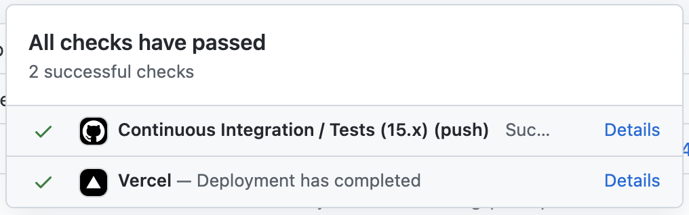

## Overview 

The Flow Playground is a web-based interactive IDE for running Cadence code.
It also provides an environment for the [Cadence intro tutorials](https://docs.onflow.org/cadence/tutorial/01-first-steps). 

The overall project consists of the web app (this) and an [API backend](https://github.com/onflow/flow-playground-api).

The Playground Web App is implemented in React. The major components are as follows:

### GraphQL / Apollo Client

- All HTTP communication with the Playground API is done via `GraphQL` using the `Apollo` client. 
- The GraphQL schema is defined by the Playground API in [schemal.graphql](https://github.com/onflow/flow-playground-api/blob/master/schema.graphql)
  - This project uses Apollo Client's `localStorage` interface as well. 
  - You can view the _local_ GraphQL schema in [local.graphql](src/api/apollo/local.graphql).
- CRUD methods (wrapped Apollo client) are implemented in [projectMutator.ts](src/providers/Project/projectMutator.ts).
- TypeScript typings and CRUD methods for Apollo are auto-generated using [GraphQL Code Generator](https://www.graphql-code-generator.com/).
- After making changes to the `schema.local` you will need to run `npm run graphql:codegen` to auto-generate new typings and methods for Apollo Client.

### Monaco Editor

- The editor interface itself is implemented using [Monaco Editor](https://microsoft.github.io/monaco-editor/).
- The editor component can be found here: https://github.com/onflow/flow-playground/tree/master/src/containers/Editor
- The Cadence language definition (for linting and syntax highlighting) for Monaco can be found here: https://github.com/onflow/flow-playground/blob/master/src/util/cadence.ts

### Cadence Language Server

- The Cadence Language Server (used by Monaco) is implemented in Golang and compiled to WASM. 
  - The WASM bundle is built from [source files in the Cadence repository](https://github.com/onflow/cadence/tree/master/npm-packages/cadence-language-server) and [published on npm](https://www.npmjs.com/package/@onflow/cadence-language-server).
- You can read more about the Cadence Language Server in the [Cadence repository](https://github.com/onflow/cadence/blob/master/languageserver/README.md).
- The Playground integration can be found here: 
  - Server: https://github.com/onflow/flow-playground/blob/master/src/util/language-server.ts
  - Client: https://github.com/onflow/flow-playground/blob/master/src/util/language-client.ts

## Deployment

The Playground Web App is deployed to [Vercel](https://vercel.com). You will see a link to join the Flow Vercel team when you open your first PR. You must be a member of the team to trigger deployments.

### Staging Deployment

URL: https://play.staging.onflow.org

The Playground Web App is deployed to https://play.staging.onflow.org each time a new commit is pushed to the `staging` branch on this repository.

1. Open a new pull request and select `staging` as the base branch. Vercel will trigger a new deployment once the PR is approved and merged.

2. Vercel will then report the deployment status on the `staging` branch:

### Production Deployment

URL: https://play.onflow.org

Once a staging deployment has been verified, you can promote the changes to production.

The Playground Web App is deployed to https://play.onflow.org each time a new commit is pushed to the `production` branch on this repository.

1. Open a new pull request and select `production` as the base branch and `staging` as the source branch. Production deployments should always deploy the same code that is already live in staging. Vercel will trigger a new deployment once the PR is approved and merged.

2. Vercel will then report the deployment status on the `production` branch:

## Important Gotcha: User Sessions & Project "Forking"

_The Playground will not function in browsers where cookies or localStorage are disabled._

### How It Works

The Playground determines what content to load into the UI based on a url query param named `projectId`.
- When a user first visits the Playground, the `projectId` param is set to `local-project`, indicating that this is a new project and has not been persisted.
  - https://github.dev/onflow/flow-playground/blob/2e3323aba9504e6a07fc13d1b2cec0e703edce43/src/util/url.ts#L16-L17
- At this point, a representation of the `Project` _model_ has been boostrapped and persisted to the browser's localStorage using Apollo
  - https://github.dev/onflow/flow-playground/blob/2e3323aba9504e6a07fc13d1b2cec0e703edce43/src/providers/Project/projectDefault.ts#L216
  - https://github.dev/onflow/flow-playground/blob/2e3323aba9504e6a07fc13d1b2cec0e703edce43/src/providers/Project/projectHooks.ts#L10-L11
- When a user performs some action that updates any field in the project, or clicks the save button, the project is read from localStorage, and sent to the API to be persisted. 
  - https://github.dev/onflow/flow-playground/blob/2e3323aba9504e6a07fc13d1b2cec0e703edce43/src/providers/Project/projectMutator.ts#L54-L55
- Once the mutation has returned successfully (The project state has been saved to the DB), another local value is set using Apollo/localstorage, to reflect the newly generated project's unique `id` (from the database)
  - https://github.dev/onflow/flow-playground/blob/2e3323aba9504e6a07fc13d1b2cec0e703edce43/src/providers/Project/projectMutator.ts#L93-L94
- The server response also sets a cookie **that links the current browser session with the new project ID** 
  - This is done so that if a user _shares_ a link to their new project (eg. https://play.onflow.org/46c7136f-803c-4166-9d46-25d8e927114c), to someone without the session cookie linking the ID and browser session, the UI will recognise (the save button becomes "fork") that this is the case, and on subsequent saves of the shared project, _will send a mutation to generate a new project based on the existing contents of the editor, preventing users from overwriting eachothers projects!_
 - The name of the cookie is `flow-playground`
